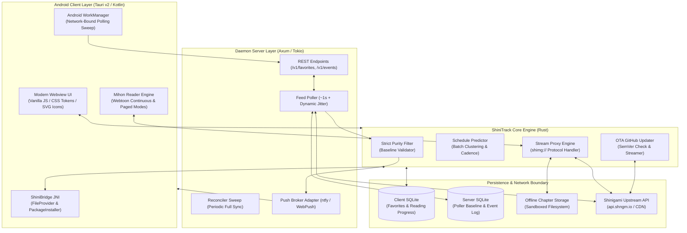

# ⚡ ShiniTrack

<div align="center">

[](LICENSE)
[](https://www.rust-lang.org/)
[](https://v2.tauri.app/)
[](https://developer.android.com/)
[](https://sqlite.org/)

<p align="center">
  <b>High-performance, offline-resilient manga release tracker, predictive schedule radar, and reader engine for Android and self-hosted environments.</b>
</p>

[Screenshots](#-screenshots) • [System Architecture](#-system-architecture) • [Key Features](#-key-features) • [Reading Gestures](#-reading-gestures--controls) • [API & IPC Reference](#-api--tauri-ipc-reference) • [Quick Start](#-quick-start) • [Disclaimer](#-disclaimer) • [License](#-license)

</div>

---

## 📖 Executive Summary & Problem Statement

**ShiniTrack** is an open-source, mobile-first manga release tracking daemon and Android application engineered in **Rust** and **Tauri v2**. Tailored specifically for comic enthusiasts, it provides hyper-accurate release notifications, empirical release forecasting, offline caching, a sequential download queue, and distraction-free comic reading.

### What Engineering Problems Does It Solve?

1. **Eliminates Notification Fatigue via Strict Purity Filtering:** Conventional RSS and scraper apps trigger notifications for every single upload across thousands of titles. ShiniTrack enforces strict baseline validation: only manga explicitly added to your favorites with active notification flags can ever trigger an alert.
2. **Conquers the "Offline Mobile Paradox":** Mobile devices disconnected from cellular or Wi-Fi networks cannot receive incoming push signals. ShiniTrack solves this using a **3-tier resilience architecture**: cloud-buffered push queues (ntfy / UnifiedPush), Android `WorkManager` background sweeps, and in-app startup delta synchronization.
3. **Bypasses Aggressive CDN Anti-Hotlinking:** Shinigami CDN endpoints strictly reject requests lacking authoritative `Referer: https://shinigami.id/` headers with HTTP 403 Forbidden. ShiniTrack implements an internal high-speed Rust stream proxy via a custom `shimg://` URI scheme that transparently negotiates headers and serves cached images instantly.
4. **Offline Comic Vault & Download Queue:** Eliminates dead zones by providing a background download queue worker that saves chapters in sandboxed local storage with pause, resume, reorder, and offline reading capabilities.

---

## 📱 Screenshots

<!-- Place screenshot images in docs/screenshots/ -->
- Pustaka (Library): `docs/screenshots/library.png`
- Detail Komik (Manga Detail): `docs/screenshots/detail.png`
- Pembaca (Reader Engine): `docs/screenshots/reader.png`
- Pembaruan (Updates Feed): `docs/screenshots/updates.png`
- Riwayat (Reading History): `docs/screenshots/history.png`
- Antrean Unduhan (Download Queue): `docs/screenshots/downloads.png`
- Statistik (Statistics): `docs/screenshots/stats.png`
- Pengaturan (Settings): `docs/screenshots/settings.png`

---

## 🏛️ System Architecture



---

## ✨ Key Features

### 1. Strict Favorite Purity Filter (Zero Noise)
- Mathematical baseline comparison: only triggers when incoming `chapter_number > stored_baseline_number`.
- Unfavorited, unselected, or muted titles are discarded at zero latency before reaching the notification pipeline.
- Automatic fractional chapter handling (e.g. Chapter `10.5` after `10` triggers accurately without false negatives).

### 2. Adaptive Schedule Predictor & Hiatus Radar
- Analyzes past release intervals using median time differences to eliminate batch upload distortions.
- Automatically clusters multi-chapter bulk drops into single analytical release points.
- Locks into weekly dominant release days and hours (e.g. *"Every Saturday ~18:00 WIB"*).
- Detects serialization hiatus when elapsed time exceeds 2.5× the established historical cadence.

### 3. High-Speed Local Proxy & Referer Shield (`shimg://`)
- Tauri custom URI scheme intercepts all image asset requests.
- Dynamically injects upstream `Referer` and `User-Agent` headers to guarantee 100% bypass of CDN anti-hotlinking (HTTP 403).
- Dual-lookup pipeline: automatically serves files from local offline storage if downloaded, falling back to upstream streaming.

### 4. Seamless In-App OTA Auto-Updater
- Checks upstream GitHub Releases API (`api.github.com/repos/{repo}/releases/latest`) on startup or on demand.
- Displays changelogs, version comparison, and real-time streaming download progress bars.
- Triggers native Android `PackageInstaller` via JNI and `FileProvider` (`ACTION_VIEW`), allowing instant 1-tap installation without third-party browsers.

### 5. Mihon-Grade Library & Category System
- **3-Way Display Modes:** Seamlessly switch between **Comfortable Grid** (large immersive covers with gradient overlays), **Compact Grid** (dense space-efficient grid), and **List** view.
- **Custom Category Tabs:** Organize manga into custom categories (managed via Ubah Kategori) with live count pills, plus built-in *Semua* and *Bawaan* tabs.
- **Tri-State Filters & Multi-Criteria Sorting:** Filter library items by *Terunduh*, *Belum Dibaca*, *Dimulai*, and *Selesai* (Include / Exclude / Off). Sort by *Alfabet*, *Terakhir Dibaca*, *Terakhir Diperbarui*, *Jumlah Belum Dibaca*, *Terakhir Ditambahkan*, or *Acak* (with ascending/descending toggle).
- **Unread Count & Activity Badges:** Visual indicator badges on manga cards for unread chapters, downloaded chapters, and notification status.
- **Batch Selection Mode:** Long-press to enter multi-select mode and reassign categories for multiple manga at once.

### 6. Dedicated Reading History
- **Grouped Timeline:** Chronological reading log grouped by day (*Hari Ini*, *Kemarin*, and calendar dates) with timestamps (*Bab N — HH:mm*).
- **Progress Persistence:** Remembers exact reading progress per chapter down to the individual page index and tracks total read duration.
- **History Search & Management:** Live debounced search across reading history, one-tap individual item deletion, and full history clearing.

### 7. Chapter Batch Management, Bookmarks & Downloads
- **Multi-Selection Mode:** Select multiple chapters at once with interactive checkboxes.
- **Batch Actions:** Mark multiple chapters as read or unread simultaneously with a single SQLite transaction.
- **Instant 1-Tap Read Toggle:** One-click checkmark button beside every chapter for immediate read/unread status flipping.
- **Chapter Bookmarks:** Toggle bookmarks per chapter from both the chapter list and reader top bar.
- **Download Queue Integration:** Queue single chapters or batches (*Unduh 1/5/10 berikutnya*, *Unduh semua belum dibaca*).
- **Sticky Resume CTA:** Sticky button in manga detail view to instantly jump into the latest unread chapter.

### 8. Multi-Directional Reader Engine
- **3 Reading Layouts:**
  - **Webtoon Mode:** Continuous vertical scroll with auto page detection and end-of-chapter transition.
  - **Paged LTR:** Traditional western comic and book mode (Left-to-Right).
  - **Manga RTL:** Authentic Japanese manga reading direction (Right-to-Left).
- **Interactive Scrubber & HUD:** Top and bottom control bars with vertical scrubber, live page count overlay, orientation lock, rotation, and crop border options.
- **Smooth Chapter Transitions & Preloading:** Transition screen at chapter completion with automatic background preloading of upcoming chapter pages.
- **Screen Keep-Awake:** Keeps the screen on while reading (configurable in settings).

### 9. Resumable Download Queue & Offline Vault
- **Background Queue Worker:** Dedicated background worker that downloads queued chapters sequentially with progress events emitted to the UI.
- **Queue Controls:** Pause, resume, retry failed items, and reorder queue positions via drag-and-drop.
- **Configurable Rules:** Optional Wi-Fi only download constraint and automatic cleanup of downloaded chapters after reading.

### 10. Updates Feed & Weekly Schedule Radar
- **Pembaruan Feed:** Day-grouped feed of newly released chapters with manual library refresh, real-time progress indicator, and filter bottom sheet.
- **Weekly Schedule Radar:** Empirical day-by-day calendar showing predicted release times and confidence levels for tracked manga.

### 11. Statistics & Data Management
- **Reading Statistics:** Aggregated metrics for total favorites, total reading duration, completed titles, total read chapters, and storage consumption.
- **Local-First Backup & Restore:** Complete JSON export and import for favorites, categories, reading progress, and settings.
- **Android Auto-Backup:** Scheduled headless backups powered by Android `WorkManager` keeping the latest snapshots.

---

## 🎮 Reading Gestures & Controls

| Gesture / Zone | Mode | Action | Technical Function |
| :--- | :--- | :--- | :--- |
| **Tap Center (30%)** | All Modes | **Toggle HUD** | Shows/hides floating Top Bar and Scrubber HUD |
| **Tap Right (35%)** | Paged L-R | **Next Page** | Advances to next page (or next chapter at end) |
| **Tap Left (35%)** | Paged L-R | **Previous Page** | Steps to previous page (or previous chapter) |
| **Tap Left (35%)** | Manga R-L | **Next Page** | Japanese reading direction: advances forward |
| **Tap Right (35%)** | Manga R-L | **Previous Page** | Japanese reading direction: steps backward |
| **Scrubber Drag** | All Modes | **Instant Seek** | Seamlessly navigates to target page index with live preview pill |
| **Scroll (Vertical)** | Webtoon | **Fluid Reading** | Continuous strip scrolling |
| **Mode Switcher** | All Modes | **Layout Switch** | Cycles dynamically: `Webtoon` ➔ `Paged L-R` ➔ `Manga R-L` |

---

## 🔌 API & Tauri IPC Reference

### Key Tauri IPC Commands

```rust
// Core Library & Feed
invoke('list_favorites')                                // -> Vec<FavoriteItem>
invoke('add_favorite', { mangaId })                     // -> ()
invoke('remove_favorite', { mangaId })                  // -> ()
invoke('set_notify', { mangaId, notify })               // -> ()
invoke('schedule_week')                                 // -> WeeklySchedule
invoke('search', { query })                             // -> SearchResponse
invoke('latest')                                        // -> Vec<MangaItem>
invoke('manga_detail', { mangaId })                     // -> MangaDetailResponse
invoke('chapters', { mangaId, page, pageSize })         // -> Vec<ChapterItem>

// Fast Library & Categories
invoke('library_list', { category, sort, filters... })  // -> Vec<LibraryRow>
invoke('category_list')                                 // -> Vec<CategoryItem>
invoke('category_create', { name })                     // -> i64
invoke('category_rename', { id, name })                 // -> ()
invoke('category_delete', { id })                       // -> ()
invoke('category_reorder', { ids })                     // -> ()
invoke('set_manga_categories', { mangaId, categoryIds }) // -> ()
invoke('get_manga_categories', { mangaId })             // -> Vec<i64>

// Reading Progress, History & Bookmarks
invoke('mark_chapter_read', { mangaId, chapterId, chapterNumber, read }) // -> ()
invoke('mark_chapters_batch', { mangaId, chapters, read })               // -> ()
invoke('list_read_chapters', { mangaId })               // -> HashSet<String>
invoke('set_chapter_bookmark', { mangaId, chapterId, chapterNumber, bookmarked }) // -> ()
invoke('list_bookmarked_chapters', { mangaId })         // -> HashSet<String>
invoke('get_reading_history', { limit })                // -> Vec<HistoryItem>
invoke('delete_history_item', { mangaId, chapterId })   // -> ()
invoke('search_history', { query, limit })              // -> Vec<HistoryItem>
invoke('clear_reading_history')                         // -> ()

// Reader & Downloads
invoke('open_chapter', { chapterId })                   // -> ChapterViewData
invoke('save_reading_progress', { mangaId, chapterId, ... }) // -> ()
invoke('get_reading_progress', { mangaId })             // -> ReadingProgress
invoke('queue_add', { mangaId, chapterId, title, chapterNumber }) // -> ()
invoke('queue_list')                                    // -> Vec<QueueItem>
invoke('queue_pause', { chapterId })                    // -> ()
invoke('queue_resume', { chapterId })                   // -> ()
invoke('queue_remove', { chapterId })                   // -> ()
invoke('delete_download', { chapterId })                // -> ()

// Updates & Diagnostics
invoke('library_update')                                // -> () (emits progress)
invoke('get_last_library_update')                       // -> Option<String>
invoke('get_statistics')                                // -> Statistics
invoke('backup_create', { includeToken })               // -> String (JSON)
invoke('backup_restore', { json })                      // -> ()
invoke('check_app_update', { repo })                    // -> UpdateCheckResult
invoke('download_and_install_update', { downloadUrl })  // -> InstallResult
```

---

## 💻 Tech Stack & Compatibility Matrix

| Component | Technology | Target / Version | Role |
| :--- | :--- | :--- | :--- |
| **Core Engine** | Rust | `1.80+` (2021 Edition) | Feed parsing, schedule predictions, and SQLite data access |
| **App Framework** | Tauri v2 | `2.0+` | Cross-platform WebView IPC and Android JNI integration |
| **Android Wrapper** | Kotlin | Android SDK 36 (Min API 26) | Native notifications, WorkManager, and package installer |
| **Server Framework** | Axum & Tokio | `0.8.x` / `1.43` | Asynchronous background feed poller & REST server |
| **Database** | SQLite & Rusqlite | Bundled / `0.32` | Local-first event queues and configuration storage |
| **HTTP Client** | Reqwest | `0.12` | Asynchronous feed scraper with connection pooling |

---

## 🚀 Quick Start

### Option 1: Install Pre-Built APK (Android)
Download the latest pre-compiled and signed release APK from [GitHub Releases](https://github.com/stenlysayd/ShiniTrack/releases):
- Grab `ShiniTrack-v*.apk` from the latest release assets.

Install via ADB or manual file transfer:
```powershell
adb install -r ShiniTrack-<version>.apk
```

---

### Option 2: Running the 24/7 Background Server (Windows / Linux / VPS)

1. **Clone the repository:**
   ```bash
   git clone https://github.com/stenlysayd/ShiniTrack.git
   cd ShiniTrack
   ```

2. **Configure your server:**
   ```bash
   cp config.example.toml config.toml
   ```

3. **Build and launch the poller daemon:**
   ```bash
   cargo run --release --bin shinitrack-server -- config.toml
   ```
   The poller will start scraping `api.shngm.io` with randomized jitter and broadcast alerts via UnifiedPush / ntfy.

---

### Option 3: Building the Android APK from Source

**Prerequisites:**
- Rust toolchain (`rustup target add aarch64-linux-android`)
- JDK 17 (`JAVA_HOME`)
- Android SDK Platform 35/36 (API 26+) & NDK 28 (`ANDROID_HOME`, `NDK_HOME`)
- Tauri CLI (`cargo install tauri-cli --version "^2.0"`)

```powershell
cargo tauri android build -t aarch64 --apk
```
*The compiled APK will be output to `app/src-tauri/gen/android/app/build/outputs/apk/universal/release/`.*

---

## 📂 Annotated Directory Tree

```text
ShiniTrack/
├── crates/
│   ├── core/                  # Shared Rust engine (Domain logic)
│   │   ├── src/api.rs         # Shinigami client (feed, detail, chapters)
│   │   ├── src/detect.rs      # Mathematical purity filter & baseline checks
│   │   ├── src/predict.rs     # Batch clustering & weekly prediction engine
│   │   ├── src/store.rs       # Local SQLite schema & migrations (Favorites, History, Categories, Queue)
│   │   └── src/models.rs      # Domain models & serialization
│   └── server/                # Standalone 24/7 poller daemon (Axum)
│       ├── src/poller.rs      # 1s poller with dynamic jitter & reconciler sweep
│       ├── src/notifier.rs    # Push dispatcher (UnifiedPush & ntfy)
│       └── src/http.rs        # REST API endpoints & Bearer auth
├── app/                       # Tauri v2 Android Client
│   ├── ui/                    # Presentation Layer (Stitch Design System)
│   │   ├── index.html         # Semantic shell & safe area insets
│   │   ├── style.css          # Dark mode token system & responsive layout
│   │   ├── icons.js           # Scalable SVG vector icon library
│   │   ├── js/                # Modular ES6 frontend architecture
│   │   │   ├── main.js        # App entry point & initialization
│   │   │   ├── router.js      # Hash-based SPA routing
│   │   │   ├── api.js         # Tauri IPC wrapper bindings
│   │   │   ├── state.js       # Shared state & preferences cache
│   │   │   ├── motion.js      # Animation & transition helpers (GSAP)
│   │   │   ├── utils.js       # Formatters, URL helpers & HTML escaping
│   │   │   ├── components/    # Reusable UI widgets (bottom-sheet, modals, rows, toasts)
│   │   │   └── views/         # Route views (library, detail, reader, updates, history, settings)
│   │   └── vendor/            # Vendor assets (gsap.min.js)
│   └── src-tauri/             # Tauri native Rust backend
│       ├── src/commands.rs    # 60+ Tauri IPC command handlers
│       ├── src/updater.rs     # In-app OTA GitHub Releases updater
│       ├── src/reader.rs      # shimg:// anti-hotlink image stream proxy
│       ├── src/download.rs    # Background download queue worker
│       └── src/jni_bridge.rs  # JNI bridge to Android Kotlin runtime
├── .github/workflows/         # CI & Release automated workflows
│   ├── ci.yml                 # Cargo test suite & Android debug build
│   └── release.yml            # Automated APK signing & GitHub Release on tag
├── docs/                      # Technical documentation & project specifications
├── DESIGN.md                  # Comprehensive Stitch Design System specification
├── LICENSE                    # MIT Open-Source License
├── config.example.toml        # Server configuration template
└── README.md                  # Project documentation & reference
```

---

## 🔧 Troubleshooting & Debugging

| Symptom | Root Cause | Exact Resolution |
| :--- | :--- | :--- |
| **Images fail with HTTP 403 Forbidden** | Upstream CDN rejects requests lacking `Referer` headers. | Ensure the reader loads images through `shimg://` proxy (`app.js` handles this automatically). |
| **Android blocks APK installation** | Missing `REQUEST_INSTALL_PACKAGES` permission in OS settings. | Grant *"Install unknown apps"* permission to ShiniTrack when prompted by Android system dialog. |
| **Notifications delayed when phone sleeps** | Aggressive vendor battery optimization (Doze Mode). | Whitelist ShiniTrack in **Settings > Apps > ShiniTrack > Battery > Unrestricted**. |
| **Server connection refused (`8787`)** | Windows Firewall or router blocking local inbound port. | Open port `8787` in Windows Defender Firewall or bind to `0.0.0.0:8787` in `config.toml`. |

---

## ❓ Frequently Asked Questions (FAQ)

**Q: Does ShiniTrack transmit personal data or reading habits to third-party servers?**  
*A: Absolutely not. ShiniTrack operates on a local-first architecture. All reading progress, bookmarks, and chapter caches remain exclusively in local SQLite tables on your device.*

**Q: Can I use ShiniTrack as a standalone reader without running the server?**  
*A: Yes! The mobile application operates autonomously. The server daemon is an optional companion designed for users who want continuous 24/7 background polling while their phone is turned off.*

**Q: How does the app update itself without the Google Play Store?**  
*A: ShiniTrack includes a built-in GitHub Releases updater. When a new release tag is published on GitHub, the app detects it, downloads the `.apk`, and invokes Android's native `PackageInstaller` via `FileProvider`.*

---

## ⚠️ Disclaimer

ShiniTrack is an unofficial, open-source personal reading tracker and manga reader application. It is not affiliated with, endorsed by, or partnered with any content providers or publishers. ShiniTrack does not host, store, or distribute any copyrighted media or content on central servers; all comic metadata and imagery are retrieved on-demand by client devices from third-party public endpoints.

---

## 📜 Privacy, Security & License

- **Privacy First:** Zero trackers, zero analytics, zero external user profiling.
- **Contributions:** Pull requests and issues are welcome! Please follow standard Git branch conventions (`feat/`, `fix/`, `docs/`).
- **License:** Distributed under the [MIT License](LICENSE). Copyright &copy; 2026 **stenlysayd**.
