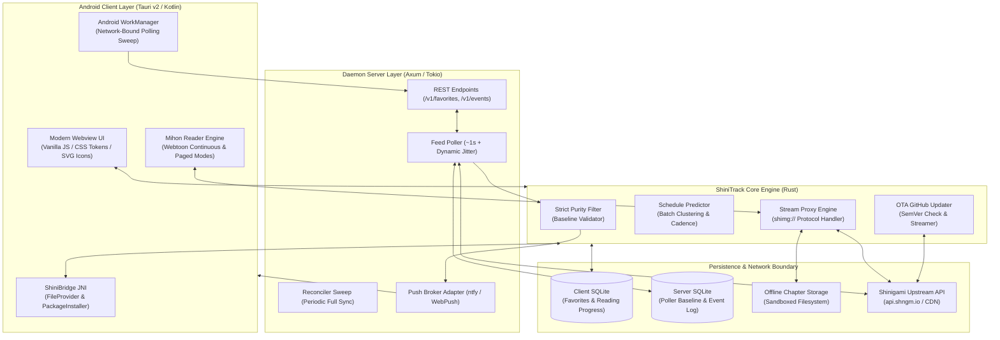

# ⚡ ShiniTrack

<div align="center">

[](LICENSE)
[](https://www.rust-lang.org/)
[](https://v2.tauri.app/)
[](https://developer.android.com/)
[](https://sqlite.org/)

<p align="center">
  <b>High-performance, offline-resilient manga release tracker, predictive schedule radar, and reader engine for Android and self-hosted environments.</b>
</p>

[Key Features](#-key-features) • [System Architecture](#-system-architecture) • [Quick Start](#-quick-start) • [Reading Gestures](#-reading-gestures--controls) • [API & IPC Reference](#-api--tauri-ipc-reference) • [Troubleshooting](#-troubleshooting--debugging) • [License](#-license)

</div>

---

## 📖 Executive Summary & Problem Statement

**ShiniTrack** is an open-source, mobile-first manga release tracking daemon and Android application engineered in **Rust** and **Tauri v2**. Tailored specifically for comic enthusiasts, it provides hyper-accurate release notifications, empirical release forecasting, offline caching, and distraction-free comic reading.

### What Engineering Problems Does It Solve?

1. **Eliminates Notification Fatigue via Strict Purity Filtering:** Conventional RSS and scraper apps trigger notifications for every single upload across thousands of titles. ShiniTrack enforces strict baseline validation: only manga explicitly added to your favorites with active notification flags can ever trigger an alert.
2. **Conquers the "Offline Mobile Paradox":** Mobile devices disconnected from cellular or Wi-Fi networks cannot receive incoming push signals. ShiniTrack solves this using a **3-tier resilience architecture**: cloud-buffered push queues (ntfy / UnifiedPush), Android `WorkManager` reconnection sweeps, and in-app startup delta synchronization.
3. **Bypasses Aggressive CDN Anti-Hotlinking:** Shinigami CDN endpoints strictly reject requests lacking authoritative `Referer: https://shinigami.id/` headers with HTTP 403 Forbidden. ShiniTrack implements an internal high-speed Rust stream proxy via a custom `shimg://` URI scheme that transparently negotiates headers and serves cached images instantly.
4. **Offline Comic Vault:** Eliminates dead zones by providing resumable, multi-threaded chapter downloads stored in sandboxed local storage for offline reading anywhere.

---

## 🏛️ System Architecture



---

## ✨ Key Features

### 1. Strict Favorite Purity Filter (Zero Noise)
- Mathematical baseline comparison: only triggers when incoming `chapter_number > stored_baseline_number`.
- Unfavorited, unselected, or muted titles are discarded at zero latency before reaching the notification pipeline.
- Automatic fractional chapter handling (e.g. Chapter `10.5` after `10` triggers accurately without false negatives).

### 2. Adaptive Schedule Predictor & Hiatus Radar
- Analyzes past release intervals using median time differences to eliminate batch upload distortions.
- Automatically clusters multi-chapter bulk drops into single analytical release points.
- Locks into weekly dominant release days and hours (e.g. *"Every Saturday ~18:00 WIB"*).
- Detects serialization hiatus when elapsed time exceeds 2.5× the established historical cadence.

### 3. High-Speed Local Proxy & Referer Shield (`shimg://`)
- Tauri custom URI scheme intercepts all image asset requests.
- Dynamically injects upstream `Referer` and `User-Agent` headers to guarantee 100% bypass of CDN anti-hotlinking (HTTP 403).
- Dual-lookup pipeline: automatically serves files from local offline storage if downloaded, falling back to upstream streaming.

### 4. Seamless In-App OTA Auto-Updater
- Checks upstream GitHub Releases API (`api.github.com/repos/{repo}/releases/latest`) on startup or on demand.
- Displays rich changelogs, version comparison, and real-time streaming download progress bars.
- Triggers native Android `PackageInstaller` via JNI and `FileProvider` (`ACTION_VIEW`), allowing instant 1-tap installation without third-party browsers.

### 5. Mihon-Grade Library & Category System
- **3-Way Display Modes:** Seamlessly switch between **Comfortable Grid** (large immersive covers with gradient overlays), **Compact Grid** (dense space-efficient grid), and **Detailed List** (with release prediction radar).
- **Dynamic Category Tabs:** Filter your library into **Semua**, **Sedang Dibaca**, **Belum Dibaca**, and **Selesai** with live count chips.
- **Multi-Criteria Sorting:** Sort titles by *Terakhir Dibaca*, *Alfabetis (A-Z)*, *Jumlah Belum Dibaca*, or *Rilis Terbaru*.
- **Unread Count & Activity Badges:** Instant visual indicators on manga cards for unread releases and notification status.

### 6. Dedicated Reading History
- **Chronological Reading Log:** Full timeline of recently read titles with relative timestamps (*"15 menit lalu"*, *"Kemarin 14:30"*).
- **Exact Page Bookmarks:** Remembers your exact reading progress per chapter down to the individual page index.
- **One-Tap Resume CTA:** Instant "Lanjut Baca" action button on every history card jumping straight into the reader.

### 7. Mihon Chapter Batch Management & Fast Toggles
- **Multi-Selection Mode:** Select multiple chapters at once with interactive checkboxes.
- **Batch Actions:** Mark dozens of chapters as read or unread simultaneously with a single SQLite transaction.
- **Instant 1-Tap Read Toggle:** One-click checkmark button beside every chapter for immediate read/unread status flipping.
- **Chapter Filter & Order:** Filter chapter lists (*Semua / Belum Dibaca / Diunduh*) and invert sorting (*Terkini ⬇* vs *Awal ⬆*).

### 8. Multi-Directional Reader Engine
- **3 Reading Layouts:**
  - **Webtoon Mode:** GPU-accelerated continuous vertical scroll with auto page detection and end-of-chapter transition.
  - **Paged LTR:** Traditional western comic and book mode (Left-to-Right).
  - **Manga RTL:** Authentic Japanese manga reading direction (Right-to-Left).
- **Interactive Scrubber & HUD:** 20px frosted backdrop blur HUD with live page count slider and chapter jump buttons.
- **Auto-Completion & Next Chapter:** Automatically marks chapters as read when reaching the final page and transitions smoothly into the next chapter.

---

## 🎮 Reading Gestures & Controls

| Gesture / Zone | Mode | Action | Technical Function |
| :--- | :--- | :--- | :--- |
| **Tap Center (30%)** | All Modes | **Toggle HUD** | Shows/hides floating Top Bar and Scrubber HUD |
| **Tap Right (35%)** | Paged L-R | **Next Page** | Advances to next page (or next chapter at end) |
| **Tap Left (35%)** | Paged L-R | **Previous Page** | Steps to previous page (or previous chapter) |
| **Tap Left (35%)** | Manga R-L | **Next Page** | Japanese reading direction: advances forward |
| **Tap Right (35%)** | Manga R-L | **Previous Page** | Japanese reading direction: steps backward |
| **Scrubber Drag** | All Modes | **Instant Seek** | Seamlessly navigates to target page index with live preview pill |
| **Scroll (Vertical)** | Webtoon | **Fluid Reading** | Hardware-accelerated continuous strip scrolling |
| **Mode Switcher** | All Modes | **Layout Switch** | Cycles dynamically: `Webtoon` ➔ `Paged L-R` ➔ `Manga R-L` |

---

## 🔌 API & Tauri IPC Reference

### Core Tauri IPC Commands

```rust
// Core Library & Feed
invoke('list_favorites')                                // -> Vec<FavoriteItem>
invoke('add_favorite', { mangaId })                     // -> ()
invoke('remove_favorite', { mangaId })                  // -> ()
invoke('set_notify', { mangaId, notify })               // -> ()
invoke('schedule_week')                                 // -> WeeklySchedule
invoke('search', { query })                             // -> SearchResponse
invoke('latest')                                        // -> Vec<MangaItem>

// Mihon Chapter & History Management
invoke('mark_chapter_read', { mangaId, chapterId, chapterNumber, read }) // -> ()
invoke('mark_chapters_batch', { mangaId, chapters, read })               // -> ()
invoke('list_read_chapters', { mangaId })               // -> HashSet<String>
invoke('get_reading_history', { limit })                // -> Vec<HistoryItem>
invoke('save_manga_meta', { mangaId, title, cover, countryId })          // -> ()

// Reader & Offline Vault
invoke('open_chapter', { chapterId })                   // -> ChapterViewData
invoke('download_chapter', { chapterId })               // -> u32 (total pages saved)
invoke('delete_download', { chapterId })                // -> ()
invoke('save_reading_progress', { ... })                // -> ()
invoke('get_reading_progress', { mangaId })             // -> ReadingProgress

// OTA Updater
invoke('check_app_update', { repo })                    // -> UpdateCheckResult
invoke('download_and_install_update', { .. })           // -> InstallResult
invoke('simulate_update_check')                         // -> MockUpdateInfo
```

---

## 💻 Tech Stack & Compatibility Matrix

| Component | Technology | Target / Version | Role |
| :--- | :--- | :--- | :--- |
| **Core Engine** | Rust | `1.99.0+` | Feed parsing, schedule predictions, and SQLite data access |
| **App Framework** | Tauri v2 | `2.0.0` | Cross-platform WebView IPC and Android JNI integration |
| **Android Wrapper** | Kotlin | Android SDK 36 (Min API 24) | Native notifications, WorkManager, and package installer |
| **Server Framework** | Axum & Tokio | `0.8.x` / `1.43` | Asynchronous 24/7 background feed poller & REST server |
| **Database** | SQLite & Rusqlite | Bundled / `0.33` | Local-first atomic event queues and configuration storage |
| **HTTP Client** | Reqwest | `0.12` | High-throughput asynchronous feed scraper with connection pooling |

---

## 🚀 Quick Start (< 3 Minutes)

### Option 1: Install Pre-Built APK (Android)
Download the latest pre-compiled and signed release directly from the repository root:
- [`ShiniTrack-v0.2.1.apk`](ShiniTrack-v0.2.1.apk) (16.2 MB, Signed v2+v3, Production Release).

Install via ADB or manual file transfer:
```powershell
adb install -r ShiniTrack-v0.2.1.apk
```

---

### Option 2: Running the 24/7 Background Server (Windows / Linux / VPS)

1. **Clone the repository:**
   ```bash
   git clone https://github.com/stenlysayd/ShiniTrack.git
   cd ShiniTrack
   ```

2. **Configure your server:**
   ```bash
   cp .env.example config.toml
   ```

3. **Build and launch the poller daemon:**
   ```bash
   cargo run --release --bin shinitrack-server -- config.toml
   ```
   The poller will immediately start scraping `api.shngm.io` every second with randomized jitter and broadcast alerts via ntfy/WebPush.

---

### Option 3: Building the Android APK from Source

**Prerequisites:**
- Rust toolchain (`rustup target add aarch64-linux-android`)
- JDK 17 (`JAVA_HOME`)
- Android SDK Platform 35/36 & NDK 28 (`ANDROID_HOME`, `NDK_HOME`)
- Tauri CLI (`cargo install tauri-cli --version "^2.0"`)

```powershell
cd app
cargo tauri android build -t aarch64 --apk
```
*The compiled APK will be output to `app/src-tauri/gen/android/app/build/outputs/apk/universal/release/`.*

---

## 📂 Annotated Directory Tree

```text
ShiniTrack/
├── crates/
│   ├── core/                  # Shared Rust engine (Domain logic)
│   │   ├── src/api.rs         # Shinigami client (feed, detail, chapters)
│   │   ├── src/detect.rs      # Mathematical purity filter & baseline checks
│   │   ├── src/predict.rs     # Batch clustering & weekly prediction engine
│   │   └── src/store.rs       # Local SQLite schema (Favorites, Progress, Events)
│   └── server/                # Standalone 24/7 poller daemon (Axum)
│       ├── src/poller.rs      # 1s poller with exponential backoff & jitter
│       ├── src/notifier.rs    # Push dispatcher (ntfy & WebPush RFC 8030)
│       └── src/http.rs        # REST API endpoints & Bearer auth
├── app/                       # Tauri v2 Android Client
│   ├── ui/                    # Presentation Layer (Stitch Design System)
│   │   ├── index.html         # Semantic shell & safe area insets
│   │   ├── style.css          # Modern dark mode token system
│   │   ├── icons.js           # 100% scalable SVG vector icon library
│   │   └── app.js             # Route controller & Tauri IPC bridge
│   └── src-tauri/             # Tauri native Rust backend
│       ├── src/commands.rs    # 25 Tauri IPC command bindings
│       ├── src/updater.rs     # OTA GitHub Releases updater
│       ├── src/reader.rs      # shimg:// anti-hotlink stream proxy
│       ├── src/download.rs    # Multi-threaded resumable chapter downloader
│       └── src/jni_bridge.rs  # JNI bridge to Android Kotlin
├── .github/workflows/         # Automated GitHub Actions CI workflow
├── DESIGN.md                  # Comprehensive Stitch Design System specification
├── LICENSE                    # MIT Open-Source License
├── .env.example               # Server environment configuration template
└── README.md                  # Showcase documentation
```

---

## 🔧 Troubleshooting & Debugging

| Symptom | Root Cause | Exact Resolution |
| :--- | :--- | :--- |
| **Images fail with HTTP 403 Forbidden** | Upstream CDN rejects requests lacking `Referer` headers. | Ensure the reader loads images through `shimg://` proxy (`app.js` handles this automatically). |
| **Android blocks APK installation** | Missing `REQUEST_INSTALL_PACKAGES` permission in OS settings. | Grant *"Install unknown apps"* permission to ShiniTrack when prompted by Android system dialog. |
| **Notifications delayed when phone sleeps** | Aggressive vendor battery optimization (Doze Mode). | Whitelist ShiniTrack in **Settings > Apps > ShiniTrack > Battery > Unrestricted**. |
| **Server connection refused (`8787`)** | Windows Firewall or router blocking local inbound port. | Open port `8787` in Windows Defender Firewall or bind to `0.0.0.0:8787` in `config.toml`. |

---

## ❓ Frequently Asked Questions (FAQ)

**Q: Does ShiniTrack transmit personal data or reading habits to third-party servers?**  
*A: Absolutely not. ShiniTrack operates on a local-first architecture. All reading progress, bookmarks, and chapter caches remain exclusively in local SQLite tables on your device.*

**Q: Can I use ShiniTrack as a standalone reader without running the server?**  
*A: Yes! The mobile application operates autonomously. The server daemon is an optional companion designed for users who want continuous 24/7 background polling while their phone is turned off.*

**Q: How does the app update itself without the Google Play Store?**  
*A: ShiniTrack includes a built-in GitHub Releases updater. When a new release tag is published on GitHub, the app detects it, downloads the `.apk`, and invokes Android's native `PackageInstaller` via `FileProvider`.*

---

## 📜 Privacy, Security & License

- **Privacy First:** Zero trackers, zero analytics, zero external user profiling.
- **Contributions:** Pull requests and issues are welcome! Please follow standard Git branch conventions (`feat/`, `fix/`, `docs/`).
- **License:** Distributed under the [MIT License](LICENSE). Copyright &copy; 2026 **stenlysayd**.
